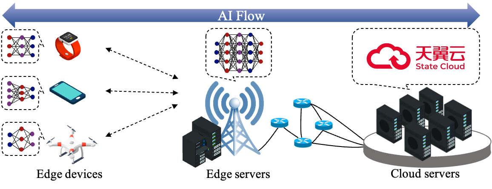
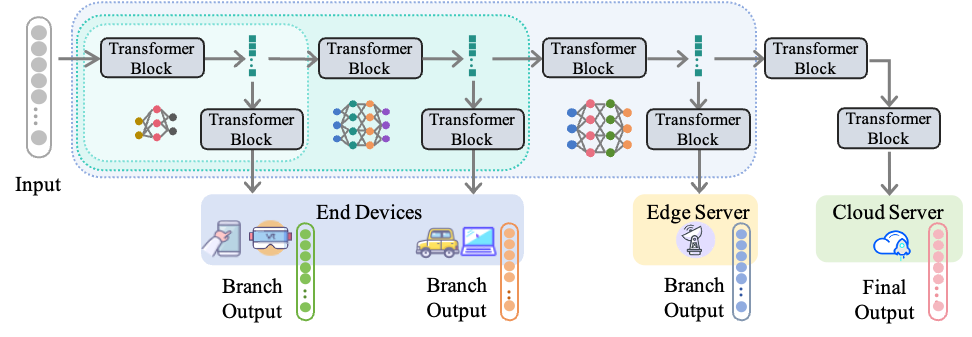

# AI-Flow-Ruyi (如意大模型)

<p align="center">
    
</p>

<p align="center">
        <a href="README.md">中文</a> &nbsp | &nbsp <a href="README_en.md">English</a>
        <br>
        🐱 <a href="https://github.com/TeleAI-AI-Flow/AI-Flow-Ruyi">GitHub</a> &nbsp&nbsp | &nbsp&nbsp 🤗 <a href="https://huggingface.co/TeleAI-AI-Flow/AI-Flow-Ruyi-7B-Preview0704">Hugging Face</a>&nbsp&nbsp | &nbsp&nbsp🤖 <a href="https://www.modelscope.cn/models/TeleAI-AI-Flow/AI-Flow-Ruyi-7B-Preview0704/">ModelScope</a>&nbsp&nbsp | &nbsp&nbsp 📑&nbsp <a href="https://www.arxiv.org/abs/2506.12479">Paper</a>
</p>

#### Long long ago...
> 龙宫中珍藏着一根神棒，能大能小，变化无穷。一日，龙王闲来无事，对着神棒感慨：“你有如此神通，若能助我龙族做些别的事该多好。”话音未落，神棒竟开口应道：“我倒有个主意，这变化之能，若用来帮世人解决难题...” 说干就干，神棒瞬间摇身一变，化作一个神通广大的“如意”大模型，能依据问题的难易，自由伸缩其“能耐”。龙王见状大喜：“这不正是能助人排忧解难的‘如意’宝贝吗？”遂为其赐名“如意”，派它前往人间济世助人。

## 新闻

* 🎉🎉[2025/7/14]：智传网（AI Flow）被国内知名科技媒体「[机器之心](https://mp.weixin.qq.com/s/fiyb3LyJOd5mr9xzAsDZ4A)」报道！
* 🎉🎉[2025/7/4]：智传网（AI Flow）被全球资讯机构[Omdia](https://omdia.tech.informa.com/om137892/on-the-radar-teleai-brings-intelligence-to-the-network-edge-through-ai-flow)纳入短评，列为生成式 AI 落地应用的“重点观察”。
* 🎉🎉[2025/7/4]：如意-7B预览版（AI-Flow-Ruyi-7B-Preview）发布

## 介绍

**如意大模型（AI-Flow-Ruyi）** 是中国电信人工智能研究院 (TeleAI) 智传网（AI Flow）团队研发，是面向下一代“端-边-云”模型服务架构的**同源家族模型（Familial Model）** 。其核心在于大小模型共享同源参数，模型能基于早退出机制，根据问题复杂度调用不同参数规模的分支模型进行响应。各分支既可独立运行，又能依托同源特性实现信息共享与无缝切换，结合端-边-云分布式部署，完成家族大小模型协同，实现模型分布式推理效率大幅提升。




## 如意-7B预览版

为了让业界能亲身体验能够自由伸缩的“家族模型”，我们开源了如意-7B预览版（AI-Flow-Ruyi-7B-Preview），以展示我们在技术落地上的决心。如意-7B预览版（AI-Flow-Ruyi-7B-Preview）于7月4日发布。其最大参数量分支为7B，可分化出具有等效参数量为3B、4B、5B、6B的早退出分支。其中：
* 3B、4B分支聚焦简单对话场景，其优势在于响应速度快、资源需求低；
* 5B、6B分支则针对日常通用任务场景，在性能与响应速度之间寻求平衡；
* 7B分支主要用于应对复杂问题，在多种能力维度上展现出较为全面的特性，但相对而言响应速度稍缓、资源需求略高。

|位点序号|早退出位置|等效模型大小|对应分支代号|场景定位|
|:-:|:-:|:-:|:-:|:-:|
|1|11层|3B|AI-Flow-Ruyi-7B-E3B|简单对话|
|2|15层|4B|AI-Flow-Ruyi-7B-E4B|简单对话|
|3|19层|5B|AI-Flow-Ruyi-7B-E5B|日常任务|
|4|23层|6B|AI-Flow-Ruyi-7B-E6B|日常任务|
|5|27层|7B|AI-Flow-Ruyi-7B-E7B|复杂问题|

### 训练过程

在训练开始前，我们基于Qwen团队预训练的[Qwen2.5-7B](https://arxiv.org/abs/2412.15115)模型（其已在18万亿高质量token上完成预训练），对7B主分支进行了参数初始化；对于早退出分支，其解码器层采用早退出位置的下一层参数进行初始化。

完成初始化后，我们采用**多分支联合预训练**方法，在私有高质量数据集上进行了约4000亿token的继续预训练，构建出如意-7B基座（AI-Flow-Ruyi-7B-Base）。

随后，我们基于约120万条高质量指令数据，对各分支进行了**联合指令遵循微调**，得到如意-7B预览版。

### 性能评测

我们基于[OpenCompass](https://github.com/open-compass/opencompass)及其官方配置文件，以0-shot方式在多个数据集上进行评测。评测结果表明，7B主分支在通用任务性能上与Qwen2.5-7B-Instruct基本持平。

<details>
<summary>通用任务评测</summary>

|模型名称|MMLU|MMLU-Pro|CMMLU|ARC-c|BBH|均分|
|:-:|:-:|:-:|:-:|:-:|:-:|:-:|
|Qwen3-8B(think)|74.78|66.02|76.33|63.39|60.68|68.24|
|Qwen2.5-7B-Instruct|70.88|56.33|75.71|86.44|51.51|68.17|
|Llama-3.1-8B-Instruct|53.16|45.36|51.65|83.73|72.47|61.27|
|AI-Flow-Ruyi-7B-E7B<b>(ours)</b>|87.19|59.78|48.14|69.83|74.47|67.88|

</details>

<details>
<summary>代码任务评测</summary>

|模型名称|MBPP|HumanEval|LiveCodeBench|均分|
|:-:|:-:|:-:|:-:|:-:|
|Qwen3-8B(think)|78.60|84.76|63.10|75.49|
|Qwen2.5-7B-Instruct|70.82|84.15|34.55|63.17|
|Llama3.1-8B-Instruct|68.48|63.41|8.15|46.68|
|AI-Flow-Ruyi-7B-E7B<b>(ours)</b>|66.93|64.63|30.01|53.86|

</details>

<details>
<summary>STEM任务评测</summary>

|模型名称|Math|GPQA|GSM-8K|均分|
|:-:|:-:|:-:|:-:|:-:|
|Qwen3-8B(think)|83.84|38.38|93.03|71.75|
|Qwen2.5-7B-Instruct|73.66|35.35|88.48|65.83|
|Llama3.1-8B-Instruct|49.22|25.25|85.82|53.43|
|AI-Flow-Ruyi-7B-E7B<b>(ours)</b>|44.94|24.75|81.65|50.45|

</details>


同时，各早退出分支性能呈现出随等效参数量单调递增的趋势。

|模型名称|MMLU|MMLU-Pro|CMMLU|ARC-c|BBH|均分|
|:-:|:-:|:-:|:-:|:-:|:-:|:-:|
|AI-Flow-Ruyi-7B-E3B<b>(ours)</b>|66.93|44.70|19.80|40.00|32.29|40.74|
|AI-Flow-Ruyi-7B-E4B<b>(ours)</b>|78.86|48.60|26.51|58.98|41.98|50.99|
|AI-Flow-Ruyi-7B-E5B<b>(ours)</b>|75.34|49.13|33.91|65.76|64.48|57.72|
|AI-Flow-Ruyi-7B-E6B<b>(ours)</b>|84.58|53.06|33.94|73.22|47.33|58.43|
|AI-Flow-Ruyi-7B-E7B<b>(ours)</b>|87.19|59.78|48.14|69.83|74.47|67.88|

## 使用

Step 1. 创建并激活虚拟环境

```sh
conda create -n ruyi python=3.12
conda activate ruyi
```

Step 2. 克隆本仓库至本地

```sh
git clone https://github.com/TeleAI-AI-Flow/AI-Flow-Ruyi.git
cd AI-Flow-Ruyi
```

Step 3. 由源码安装（PS: flash_attn编译安装较慢，建议移步[官方仓库](https://github.com/Dao-AILab/flash-attention/releases/tag/v2.7.4.post1)下载whl手动安装）

```sh
pip install -e .
```

Step 4. 下载模型权重

```sh
git clone https://www.modelscope.cn/TeleAI-AI-Flow/AI-Flow-Ruyi-7B-Preview0704.git models/AI-Flow-Ruyi-7B-Preview0704
```

Step 5. 运行Demo

```sh
python demo.py
```

<details>
<summary>查看Demo代码</summary>

```py
import torch
from ruyi.global_var import set_global_val
from transformers import GenerationConfig
from transformers import AutoModelForCausalLM, AutoTokenizer


model_path = f"models/AI-Flow-Ruyi-7B-Preview0704"
tokenizer = AutoTokenizer.from_pretrained(model_path, trust_remote_code=True)
model = AutoModelForCausalLM.from_pretrained(model_path, trust_remote_code=True, attn_implementation='flash_attention_2', torch_dtype=torch.bfloat16).to('cuda')


generation_config = GenerationConfig(
    do_sample=True,                  
    top_k=30,                        
    top_p=0.95,                      
    temperature=0.6,                 
    repetition_penalty=1.2,          
    no_repeat_ngram_size=3,          
    max_new_tokens=8192
)

# 输入文本
messages = [
    {"role": "user", "content": "介绍一下你自己。"},
]

# 应用 chat_template 模板
prompt = tokenizer.apply_chat_template(messages, tokenize=False, add_generation_prompt=True)
inputs = tokenizer(prompt, return_tensors="pt")

# 模型生成
with torch.no_grad():
    # 设置早退出点
    # - 11: 第一个早退出点，对应约3B
    # - 15: 第二个早退出点，对应约4B
    # - 19: 第三个早退出点，对应约5B
    # - 23: 第四个早退出点，对应约6B
    # - 27: 第五个早退出点，对应约7B
    set_global_val("early_exit_point", 11)  

    output = model.generate(
        inputs["input_ids"].to('cuda'),
        generation_config=generation_config
    )

# 解码并打印结果
generated_text = tokenizer.decode(output[0], skip_special_tokens=False)
print(generated_text)
```

</details>

## 引用

```bibtex
@misc{an2025aiflowperspectivesscenarios,
      title={AI Flow: Perspectives, Scenarios, and Approaches}, 
      author={Hongjun An and Wenhan Hu and Sida Huang and Siqi Huang and Ruanjun Li and Yuanzhi Liang and Jiawei Shao and Yiliang Song and Zihan Wang and Cheng Yuan and Chi Zhang and Hongyuan Zhang and Wenhao Zhuang and Xuelong Li},
      year={2025},
      eprint={2506.12479},
      archivePrefix={arXiv},
      primaryClass={cs.AI},
      url={https://arxiv.org/abs/2506.12479}, 
}
```
