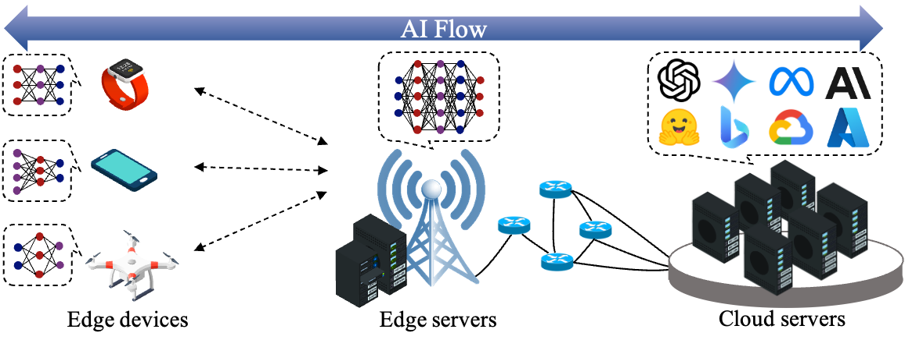
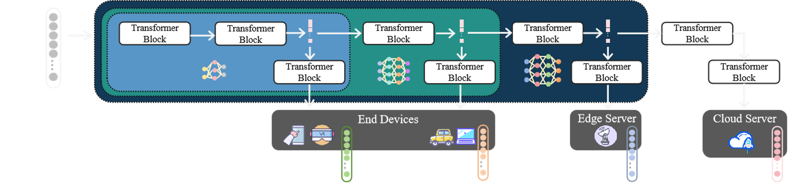

# AI-Flow-Ruyi (如意大模型)

<p align="center">
    
</p>

<p align="center">
        <a href="README.md">中文</a> &nbsp | &nbsp <a href="README_en.md">English</a>
        <br>
        🐱 <a href="https://github.com/TeleAI-AI-Flow/AI-Flow-Ruyi">GitHub</a> &nbsp&nbsp | &nbsp&nbsp 🤗 <a href="https://huggingface.co/TeleAI-AI-Flow/AI-Flow-Ruyi-7B-0725">Hugging Face</a>&nbsp&nbsp | &nbsp&nbsp🤖 <a href="https://www.modelscope.cn/models/TeleAI-AI-Flow/AI-Flow-Ruyi-7B-0725">ModelScope</a>&nbsp&nbsp | &nbsp&nbsp 📑&nbsp <a href="https://www.arxiv.org/abs/2506.12479">Paper</a>
</p>

## News

* 🎉🎉[2025/7/25]：AI-Flow-Ruyi-7B released!
* 🎉🎉[2025/7/4]：TeleAI’s AI Flow is now on the radar of global analyst firm [Omdia](https://omdia.tech.informa.com/om137892/on-the-radar-teleai-brings-intelligence-to-the-network-edge-through-ai-flow) as a generative-AI solution to watch.
* 🎉🎉[2025/7/4]：AI-Flow-Ruyi-7B-Preview released!

## Introduction

**AI-Flow-Ruyi** is a **Familial Model** developed by the AI Flow team  of the Institute of Artificial Intelligence (TeleAI), China Telecom. Designed for next-generation "Device-Edge-Cloud" model service architectures, its core innovation lies in **shared familial parameters** across large and small models. Leveraging an **early-exit mechanism**, the system dynamically routes queries to branch models of appropriate parameter sizes based on problem complexity. These branches operate independently while enabling **information sharing** and **seamless transitions** through their shared features. Combined with distributed Device-Edge-Cloud deployment, this facilitates **collaborative inference** within the model family, significantly enhancing distributed reasoning efficiency.




## AI-Flow-Ruyi-7B

To give the community a hands-on experience with a truly elastic “family of models,” we are open-sourcing the Ruyi-7B (AI-Flow-Ruyi-7B), released on 25 July. Its largest branch contains 7 billion parameters and can spawn early-exit sub-networks with effective parameter counts of 3 B, 4 B, 5 B, and 6 B:

Key branch specializations:
* **3B/4B branches**: Optimized for simple dialogue scenarios, delivering **faster response times** with **minimal resource consumption**
* **5B/6B branches**: Targeting daily general-purpose tasks, **striking a balance** between capability and responsiveness
* **7B branch**: Designed for complex problem-solving, **exhibiting more well-rounded capabilities** across multiple dimensions – though with **moderately slower inference speeds** and **higher resource demands**

|Position No.|Early-Exit Layer|Equivalent Model Size|Branch Designation|Target Scenario|
|:-:|:-:|:-:|:-:|:-:|
|1|Layer 11|3B|AI-Flow-Ruyi-7B-E3B|Simple dialogue|
|2|Layer 15|4B|AI-Flow-Ruyi-7B-E4B|Simple dialogue|
|3|Layer 19|5B|AI-Flow-Ruyi-7B-E5B|Daily tasks|
|4|Layer 23|6B|AI-Flow-Ruyi-7B-E6B|Daily tasks|
|5|Layer 27|7B|AI-Flow-Ruyi-7B-E7B|Complex problems|

### Training process

Prior to training initiation, we initialized parameters for the 7B main branch using Qwen team's pre-trained [Qwen2.5-7B](https://arxiv.org/abs/2412.15115) (pre-trained on 18 trillion high-quality tokens). For early-exit branches, decoder layers were initialized with parameters from the subsequent layer of their respective early-exit positions.

Following initialization, we conducted **multi-branch joint pre-training** with approximately 400 billion tokens on proprietary high-quality datasets, resulting in the AI-Flow-Ruyi-7B-Base foundation model.

Subsequently, we performed **multi-branch joint instruction-following fine-tuning** across all branches using ~0.7 million high-quality instruction samples, yielding the AI-Flow-Ruyi-7B.

### Performance review

We conduct a review based on [OpenCompass](https://github.com/open-compass/opencompass) and its official configuration files on multiple datasets in a 0-shot manner. 

<details>
<summary>Common tasks review</summary>

|Model|MMLU|MMLU-Pro|CMMLU|BBH|ARC-c|HellaSwag|Winogrand|Mean|
|:-:|:-:|:-:|:-:|:-:|:-:|:-:|:-:|:-:|
|Qwen3-8B(think)|74.78|66.02|76.33|60.68|63.39|66.11|56.25|66.22| 
|Llama3.1-8B-Instruct|53.16|45.36|51.65|72.47|83.73|71.37|58.54|62.33|
|Qwen2.5-7B-Instruct|70.88|56.33|75.71|51.51|86.44|81.13|68.30|70.04| 
|AI-Flow-Ruyi-7B-E7B-0725<b>(ours)</b>|64.78|56.39|76.17|81.37|82.71|76.69|63.22|71.62|

</details>

<details>
<summary>Code tasks review</summary>

|Model|HumanEval|MBPP|LiveCodeBench|Mean|
|:-:|:-:|:-:|:-:|:-:|
|Qwen3-8B(think)|84.76|78.60|63.10|75.49|
|Qwen2.5-7B-Instruct|63.41|68.48|8.15|46.68|
|Llama3.1-8B-Instruct|84.15|70.82|34.55|63.17|
|AI-Flow-Ruyi-7B-E7B-0725<b>(ours)</b>|76.83|77.04|28.44|60.77|

</details>

<details>
<summary>STEM tasks review</summary>

|Model|GPQA|Math|GSM-8K|Mean|
|:-:|:-:|:-:|:-:|:-:|
|Qwen3-8B(think)|38.38|83.84|93.03|71.75|
|Qwen2.5-7B-Instruct|25.25|49.22|85.82|53.43|
|Llama3.1-8B-Instruct|35.35|73.66|88.48|65.83|
|AI-Flow-Ruyi-7B-E7B-0725<b>(ours)</b>|30.30|72.18|91.36|64.61|

</details>


At the same time, the performance of each early exit branch shows a monotonically increasing trend with the number of equivalent parameters.

|Model|MMLU|MMLU-Pro|CMMLU|BBH|ARC-c|HellaSwag|Winogrand|Mean|
|:-:|:-:|:-:|:-:|:-:|:-:|:-:|:-:|:-:|
|AI-Flow-Ruyi-7B-E3B-0725<b>(ours)</b>|34.67|17.49|43.99|31.63|47.12|31.20|49.59|36.53|
|AI-Flow-Ruyi-7B-E4B-0725<b>(ours)</b>|52.63|30.10|45.04|50.94|77.63|61.63|51.99|52.85|
|AI-Flow-Ruyi-7B-E5B-0725<b>(ours)</b>|61.09|48.54|66.64|75.41|82.03|74.91|61.46|67.15|
|AI-Flow-Ruyi-7B-E6B-0725<b>(ours)</b>|63.96|53.98|74.95|79.33|81.36|76.64|62.96|70.45|
|AI-Flow-Ruyi-7B-E7B-0725<b>(ours)</b>|64.78|56.39|76.17|81.37|82.71|76.69|63.22|71.62|


<details>
<summary>[History]AI-Flow-Ruyi-7B-Preview</summary>

## AI-Flow-Ruyi-7B-Preview

To give the community a hands-on experience with a truly elastic “family of models,” we are open-sourcing the Ruyi-7B Preview (AI-Flow-Ruyi-7B-Preview), released on 4 July. Its largest branch contains 7 billion parameters and can spawn early-exit sub-networks with effective parameter counts of 3 B, 4 B, 5 B, and 6 B:

Key branch specializations:
* **3B/4B branches**: Optimized for simple dialogue scenarios, delivering **faster response times** with **minimal resource consumption**
* **5B/6B branches**: Targeting daily general-purpose tasks, **striking a balance** between capability and responsiveness
* **7B branch**: Designed for complex problem-solving, **exhibiting more well-rounded capabilities** across multiple dimensions – though with **moderately slower inference speeds** and **higher resource demands**

|Position No.|Early-Exit Layer|Equivalent Model Size|Branch Designation|Target Scenario|
|:-:|:-:|:-:|:-:|:-:|
|1|Layer 11|3B|AI-Flow-Ruyi-7B-E3B|Simple dialogue|
|2|Layer 15|4B|AI-Flow-Ruyi-7B-E4B|Simple dialogue|
|3|Layer 19|5B|AI-Flow-Ruyi-7B-E5B|Daily tasks|
|4|Layer 23|6B|AI-Flow-Ruyi-7B-E6B|Daily tasks|
|5|Layer 27|7B|AI-Flow-Ruyi-7B-E7B|Complex problems|

### Training process

Prior to training initiation, we initialized parameters for the 7B main branch using Qwen team's pre-trained [Qwen2.5-7B](https://arxiv.org/abs/2412.15115) (pre-trained on 18 trillion high-quality tokens). For early-exit branches, decoder layers were initialized with parameters from the subsequent layer of their respective early-exit positions.

Following initialization, we conducted **multi-branch joint pre-training** with approximately 400 billion tokens on proprietary high-quality datasets, resulting in the AI-Flow-Ruyi-7B-Base foundation model.

Subsequently, we performed **multi-branch joint instruction-following fine-tuning** across all branches using ~1.2 million high-quality instruction samples, yielding the AI-Flow-Ruyi-7B-Preview.

### Performance review

We conduct a review based on [OpenCompass](https://github.com/open-compass/opencompass) and its official configuration files on multiple datasets in a 0-shot manner. The evaluation results show that the 7B master branch is basically equal to Qwen2.5-7B-Instruct in terms of general-purpose task performance.

<details>
<summary>Common tasks review</summary>

|Model|MMLU|MMLU-Pro|CMMLU|ARC-c|BBH|Mean|
|:-:|:-:|:-:|:-:|:-:|:-:|:-:|
|Qwen3-8B(think)|74.78|66.02|76.33|63.39|60.68|68.24|
|Qwen2.5-7B-Instruct|70.88|56.33|75.71|86.44|51.51|68.17|
|Llama-3.1-8B-Instruct|53.16|45.36|51.65|83.73|72.47|61.27|
|AI-Flow-Ruyi-7B-E7B<b>(ours)</b>|87.19|59.78|48.14|69.83|74.47|67.88|

</details>

<details>
<summary>Code tasks review</summary>

|Model|MBPP|HumanEval|LiveCodeBench|Mean|
|:-:|:-:|:-:|:-:|:-:|
|Qwen3-8B(think)|78.60|84.76|63.10|75.49|
|Qwen2.5-7B-Instruct|70.82|84.15|34.55|63.17|
|Llama3.1-8B-Instruct|68.48|63.41|8.15|46.68|
|AI-Flow-Ruyi-7B-E7B<b>(ours)</b>|66.93|64.63|30.01|53.86|

</details>

<details>
<summary>STEM tasks review</summary>

|Model|Math|GPQA|GSM-8K|Mean|
|:-:|:-:|:-:|:-:|:-:|
|Qwen3-8B(think)|83.84|38.38|93.03|71.75|
|Qwen2.5-7B-Instruct|73.66|35.35|88.48|65.83|
|Llama3.1-8B-Instruct|49.22|25.25|85.82|53.43|
|AI-Flow-Ruyi-7B-E7B<b>(ours)</b>|44.94|24.75|81.65|50.45|

</details>


At the same time, the performance of each early exit branch shows a monotonically increasing trend with the number of equivalent parameters.

|Model|MMLU|MMLU-Pro|CMMLU|ARC-c|BBH|Mean|
|:-:|:-:|:-:|:-:|:-:|:-:|:-:|
|AI-Flow-Ruyi-7B-E3B<b>(ours)</b>|66.93|44.70|19.80|40.00|32.29|40.74|
|AI-Flow-Ruyi-7B-E4B<b>(ours)</b>|78.86|48.60|26.51|58.98|41.98|50.99|
|AI-Flow-Ruyi-7B-E5B<b>(ours)</b>|75.34|49.13|33.91|65.76|64.48|57.72|
|AI-Flow-Ruyi-7B-E6B<b>(ours)</b>|84.58|53.06|33.94|73.22|47.33|58.43|
|AI-Flow-Ruyi-7B-E7B<b>(ours)</b>|87.19|59.78|48.14|69.83|74.47|67.88|

</details>

## Usage

Step 1. Create and activate a virtual environment

```sh
conda create -n ruyi python=3.12
conda activate ruyi
```

Step 2. Clone this warehouse to local

```sh
git clone https://github.com/TeleAI-AI-Flow/AI-Flow-Ruyi.git
cd AI-Flow-Ruyi
```

Step 3. Installation from source (PS: flash_attn compilation and installation is slow, it is recommended to move to the [official repository](https://github.com/Dao-AILab/flash-attention/releases/tag/v2.7.4.post1) to download whl manual installation)

```sh
pip install -e .
```

Step 4. Download model weights

```sh
git clone https://www.modelscope.cn/TeleAI-AI-Flow/AI-Flow-Ruyi-7B-0725.git models/AI-Flow-Ruyi-7B-0725
```

Step 5. Run Demo

```sh
python demo.py
```

<details>
<summary>View demo code</summary>

```py
import torch
from ruyi.global_var import set_global_val
from transformers import GenerationConfig
from transformers import AutoModelForCausalLM, AutoTokenizer


model_path = f"models/AI-Flow-Ruyi-7B-0725"
tokenizer = AutoTokenizer.from_pretrained(model_path, trust_remote_code=True)
model = AutoModelForCausalLM.from_pretrained(model_path, trust_remote_code=True, attn_implementation='flash_attention_2', torch_dtype=torch.bfloat16).to('cuda')


generation_config = GenerationConfig(
    do_sample=True,                  
    top_k=30,                        
    top_p=0.95,                      
    temperature=0.6,                 
    repetition_penalty=1.2,          
    no_repeat_ngram_size=3,          
    max_new_tokens=8192
)

# input text
messages = [
    {"role": "user", "content": "Introduce yourself."},
]

# Apply chat_template template
prompt = tokenizer.apply_chat_template(messages, tokenize=False, add_generation_prompt=True)
inputs = tokenizer(prompt, return_tensors="pt")

# Model Generation
with torch.no_grad():
    # Setting the early exit point
    # - 11: First early exit point corresponding to about 3B.
    # - 15: second early exit point, corresponding to approximately 4B.
    # - 19: third early exit point, corresponding to about 5B.
    # - 23: fourth early exit point, corresponding to approximately 6B.
    # - 27: fifth early exit point, corresponding to about 7B.
    set_global_val("early_exit_point", 11)  

    output = model.generate(
        inputs["input_ids"].to('cuda'),
        generation_config=generation_config
    )

# Decode and print results
generated_text = tokenizer.decode(output[0], skip_special_tokens=False)
print(generated_text)
```

</details>

## Citation

```bibtex
@misc{an2025aiflowperspectivesscenarios,
      title={AI Flow: Perspectives, Scenarios, and Approaches}, 
      author={Hongjun An and Wenhan Hu and Sida Huang and Siqi Huang and Ruanjun Li and Yuanzhi Liang and Jiawei Shao and Yiliang Song and Zihan Wang and Cheng Yuan and Chi Zhang and Hongyuan Zhang and Wenhao Zhuang and Xuelong Li},
      year={2025},
      eprint={2506.12479},
      archivePrefix={arXiv},
      primaryClass={cs.AI},
      url={https://arxiv.org/abs/2506.12479}, 
}
```
